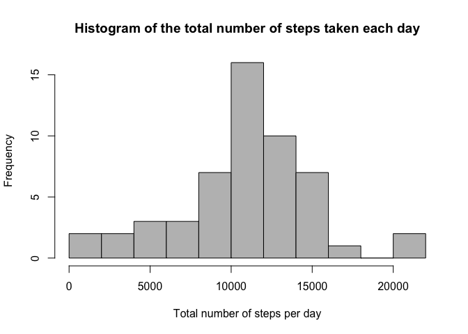
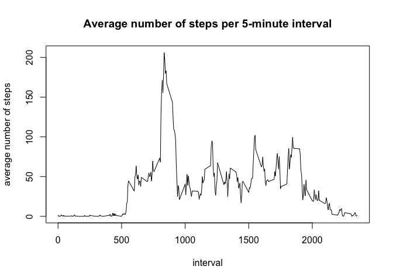
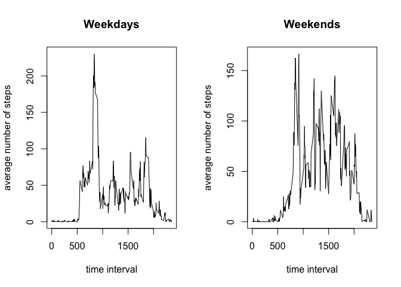

# Reproducible Research: Peer Assessment 1

This assignment makes use of data from a personal activity monitoring device. This device collects data at 5 minute intervals through out the day. The data consists of two months of data from an anonymous individual collected during the months of October and November, 2012 and include the number of steps taken in 5 minute intervals each day. 

The data for this assignment can be downloaded from the course web site: <https://d396qusza40orc.cloudfront.net/repdata%2Fdata%2Factivity.zip>

The variables included in this dataset are:

* **steps**: Number of steps taken in a 5-minute interval (missing values are coded as NA)

* **date**: The date on which the measurement was taken in YYYY-MM-DD format

* **interval**: Identifier for the 5-minute interval in which measurement was taken

The dataset is stored in a comma-separated-value (CSV) file *activity.csv* and there is a total of 17,568 observations in this dataset.


## Loading and preprocessing the data
1. Load the data.


```r
# Read the data
activity = as.data.frame(read.csv("activity.csv", header = TRUE))
```

2. Process/transform the data (if necessary) into a format suitable for your analysis


```r
# Transform the date into a suitable date format
activity$date = as.POSIXct(activity$date, format = "%Y-%m-%d")
```

## What is mean total number of steps taken per day?

1. Calculate the total number of steps taken per day


```r
# Find the total number of steps taken each day
stepsPerDay = with(activity, tapply(steps, date, sum, na.rm = FALSE))
```

2. Make a histogram of the total number of steps taken each day


```r
# Make a histogram
hist(stepsPerDay, main = "Histogram of the total number of steps taken each day", breaks = 10,
    xlab = "Total number of steps per day", ylab = "Frequency", col="gray")
```

 

3. Calculate and report the mean and median of the total number of steps taken per day


```r
# Calculate the mean of the total number of steps taken per day
meanStepsPerDay = mean(stepsPerDay, na.rm = TRUE)
# Report the mean
meanStepsPerDay
```

```
## [1] 10766.19
```

```r
# Calculate the median of the total number of steps taken per day
medianStepsPerDay = median(stepsPerDay, na.rm = TRUE)
# Report the median
medianStepsPerDay
```

```
## [1] 10765
```
## What is the average daily activity pattern?

1. Make a time series plot (i.e. type = "l") of the 5-minute interval (x-axis) and the average number of steps taken, averaged across all days (y-axis)


```r
# Find the average number of steps taken at each 5-minute interval, averaged across all days 
meanStepsPerInterval = with(activity, tapply(steps, interval, mean, na.rm = TRUE))
# Make a time series plot of meanStepsPerIneterval
plot(unique(activity$interval), meanStepsPerInterval, type = "l", main = "Average number of steps per 5-minute interval", xlab = "interval", ylab = "average number of steps")
```

 

2. Which 5-minute interval, on average across all the days in the dataset, contains the maximum number of steps?

```r
# Find which 5-minute interval contains the maximum number of steps
whichIntervalMax = meanStepsPerInterval[which.max(meanStepsPerInterval)]
whichIntervalMax
```

```
##      835 
## 206.1698
```


## Imputing missing values

Note that there are a number of days/intervals where there are missing values (coded as NA). The presence of missing days may introduce bias into some calculations or summaries of the data.

1. Calculate and report the total number of missing values in the dataset (i.e. the total number of rows with NAs)

```r
# Count how many observations are missing
sum(is.na(activity$steps))
```

```
## [1] 2304
```

2. Devise a strategy for filling in all of the missing values in the dataset: will use the mean for that 5-minute interval.

3. Create a new dataset that is equal to the original dataset but with the missing data filled in.

```r
# Rows of data that have missing values 
whichMissing = !complete.cases(activity$steps)
# Duplicate the activity dataset
activityNew = activity
# Replicate meanStepsPerInterval for each day (based on the total number of days)
repMeanStepsPerInterval = rep(meanStepsPerInterval,length(unique(activity$date)))
# Fill in the missing data using average number of steps for that 5 minute interval
activityNew$steps[whichMissing] = repMeanStepsPerInterval[whichMissing]
```

4. Make a histogram of the total number of steps taken each day and calculate and report the mean and median total number of steps taken per day. Do these values differ from the estimates from the first part of the assignment? What is the impact of imputing missing data on the estimates of the total daily number of steps?

```r
# Calculate the total number of steps taken each day
stepsPerDayNew = with(activityNew, tapply(steps, date, sum, na.rm = FALSE))
# Make a histogram of the total number of steps taken each day
hist(stepsPerDayNew, main = "Histogram of the total number of steps taken each day", breaks = 10,
    xlab = "Total number of steps per day", ylab = "Frequency", col="gray")
```

 

```r
# Calculate the mean of the total number of steps taken per day
meanStepsPerDayNew = mean(stepsPerDayNew)
# Report the mean
meanStepsPerDayNew
```

```
## [1] 10766.19
```

```r
# Calculate the median 
medianStepsPerDayNew = median(stepsPerDayNew)
# Report the median
medianStepsPerDayNew
```

```
## [1] 10766.19
```

```r
# Report the impact on the mean 
meanStepsPerDayNew - meanStepsPerDay
```

```
## [1] 0
```

```r
# Report the impact on the median
medianStepsPerDayNew - medianStepsPerDay
```

```
## [1] 1.188679
```


## Are there differences in activity patterns between weekdays and weekends?

For this part the weekdays() function may be of some help here. Use the dataset with the filled-in missing values for this part.

1. Create a new factor variable in the dataset with two levels – “weekday” and “weekend” indicating whether a given date is a weekday or weekend day.

```r
# Create an index variable representing weekends
weekend = weekdays(activityNew$date) %in% c("Saturday", "Sunday")
# Add a column "day" to the activityNew dataset representing weekday
activityNew$day = "weekday"
# Update the column "day" to indicate weekends
activityNew$day[weekend] = "weekend"
# Convert the column day to a factor variable
activityNew$day = as.factor(activityNew$day)
```

2. Make a panel plot containing a time series plot (i.e. type = "l") of the 5-minute interval (x-axis) and the average number of steps taken, averaged across all weekday days or weekend days (y-axis). 

```r
# Find the average number of steps taken, averaged across all weekday days 
meanStepsPerIntervalWeekday = with(activityNew[activityNew$day == "weekday",], tapply(steps, interval, mean, na.rm = TRUE))
# Find the average number of steps taken, averaged across all weekend days
meanStepsPerIntervalWeekend = with(activityNew[activityNew$day == "weekend",], tapply(steps, interval, mean, na.rm = TRUE))
# Make a panel plot (using lattice package) containing a time series of the 5-minute interval and the average number of steps taken, averaged across all weekday days and weekend days
par(mfrow = c(1,2))
with(activityNew,{
    # Weekday plot
    plot(unique(interval), meanStepsPerIntervalWeekday, type = "l", main = "Weekdays",    xlab = "time interval", ylab = "average number of steps")
    # Weekday plot
    plot(unique(interval), meanStepsPerIntervalWeekend, type = "l", main = "Weekends",    xlab = "time interval", ylab = "average number of steps")
})
```

 


